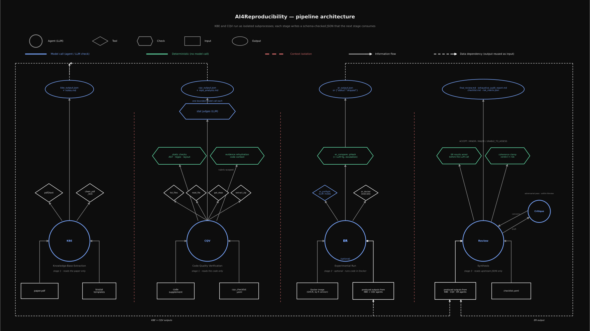

# AI4Reproducibility

**Lead developer:** Boris P. Hejblum — [boris.hejblum@u-bordeaux.fr](mailto:boris.hejblum@u-bordeaux.fr)
**Developer:** Jad El Karchi — [jad.el-karchi@u-bordeaux.fr](mailto:jad.el-karchi@u-bordeaux.fr)

Inserm UMR 1219 BPH / SISTM team — University of Bordeaux & Inria

[](https://github.com/sistm/AI4Reproducibility/actions/workflows/ci.yml)


> **AI4Reproducibility** is an agentic pipeline for automated reproducibility
> review of scientific manuscripts. It reads a submission's PDF and its code
> supplement and produces an evidence-anchored audit with a structured verdict.
> It is built on one premise: a tool that judges reproducibility must itself be
> auditable and reproducible.

---

## At a glance

| | |
|---|---|
| **Input** | Manuscript PDF + code supplement (zip or directory) |
| **Output** | Four deliverables — reviewer narrative, exhaustive audit, populated checklist, machine-readable risk matrix |
| **Verdicts** | `ACCEPT` / `MINOR REVISION` / `MAJOR REVISION` / `UNABLE_TO_ASSESS` |
| **Agents** | Five — KBE, CQV, ER *(optional)*, Review, and Critique *(an adversarial pass that runs within Review)* |
| **Deterministic checks** | 33 static checks (AST, regex, file layout) — no LLM in the loop |
| **Bounded LLM judges** | 16 statistical / code-quality judges, one rubric-scoped call each |
| **Rubrics** | Two YAML checklists — 24 reproducibility items, 36 code-quality items |
| **Code execution** | Optional Dockerized run with perceptual-hash figure/table comparison |
| **Test suite** | 653 tests, no LLM access required |
| **Domain** | Biostatistics and computational biology; R-first, adaptable via YAML |

---

## Status and scope

**Alpha.** The infrastructure is mature and well covered by tests. What has
*not* yet been established is the pipeline's own accuracy: there is no
agreement study against human reviewers, no labelled benchmark corpus, and the
ER stage has not been validated end-to-end on a real submission archive (its
pHash threshold in particular is uncalibrated).

Treat current output as **decision support for a human reviewer**, never as an
editorial decision. See [Limitations and responsible use](#limitations-and-responsible-use).

---

## Design principles

Four commitments explain most of the architecture — and most of its cost:

1. **Deterministic where possible, bounded where not.** Anything mechanically
   checkable is checked in Python. The LLM handles judgment that genuinely
   requires it, in small rubric-scoped calls whose verdicts are injected
   downstream as settled rather than re-litigated.
2. **No finding without evidence.** Every item in the audit cites a file and a
   line. The output schema rejects findings that do not.
3. **Contexts are separated by construction.** The agent that reads the paper
   and the agent that reads the code are different processes and cannot see
   each other's inputs or outputs.
4. **Degrade, don't guess.** A stage that cannot complete still writes a valid
   `partial` / `failed` output; dependent checklist items become *Unverified*
   rather than being silently passed or failed.

---

## Pipeline



```
Legend:  (Agent) = LLM call    [tool]    <<check>> = deterministic (no model call)
         v / . = information flow (top-to-bottom, matching the page)
         gap between boxes = context-isolation boundary
         the connector diagrams below each row = data dependency
         (a produced output reused as another agent's input)

+--------------------------------------+    +--------------------------------------+
|            STAGE 1a . KBE            |    |            STAGE 1b . CQV            |
|         reads the paper only         |    |         reads the code only          |
|                                      |    |                                      |
|       [paper.pdf]    [biostat        |    |          [code supplement]           |
|      input           templates]      |    |         [cqv_checklist.yaml]         |
|                      v               |    |                      v               |
|                      .               |    |       [list_files] [read_file]       |
|     [pdf2text] [clean_pdf_text]      |    |       [get_deps] [extract_zip]       |
|                      v               |    |                      v               |
|                      .               |    |                  ( CQV )             |
|                  ( KBE )             |    |                      v               |
|                      v               |    |          <<static checks>>           |
|                      .               |    |       <<evidence rehydration>>       |
|         ( kbe_output.json )          |    |                      v               |
|                                      |    |        ( stat judges . LLM )         |
|                                      |    |                      v               |
|                                      |    |          ( cqv_output.json           |
|                                      |    |          + repo_analysis )           |
+--------------------------------------+    +--------------------------------------+

     ( kbe_output.json )                    ( cqv_output.json + repo_analysis )     
                        |                                          |                
                       +--------------------+-----------------------+               
                                                        |                           
                                           KBE + CQV outputs                        
                                           /                \                       
                                          /                  \                      
                                        v                    v                      
              dependency: feeds ER      dependency: continues toward Review         

+--------------------------------------+    +--------------------------------------+
|       STAGE 2 . ER  (optional)       |    |           STAGE 3 . Review           |
|      --er-enabled; runs Docker       |    |       reads upstream JSON only       |
|                                      |    |                                      |
|   [Docker image]      [dependency:   |    |  [checklist.yaml]     [dependency:   |
|                    KBE+CQV outputs]  |    |                  KBE.CQV.ER outputs] |
|                      v               |    |                      v               |
|     [er_preflight]  [er_docker]      |    |    (Review) --draft--> (Critique     |
|       (LLM: mode)   (execute)        |    |        <--concerns--       LLM,      |
|                      v               |    |                      within Review)  |
|                   ( ER )             |    |                      v               |
|                      v               |    |      <<ER wired>>   <<coherence      |
|         <<er_compare: pHash          |    |                     clamp>>          |
|        + LLM fig. escalation>>       |    |                      v               |
|                      v               |    |      verdict: ACCEPT / MINOR /       |
|           ( er_output.json           |    |       MAJOR / UNABLE_TO_ASSESS       |
|            or {"skipped"} )          |    |                      v               |
|                                      |    |          ( final_review.md           |
|                                      |    |     + exhaustive_audit_report.md     |
|                                      |    |            + checklist.md            |
|                                      |    |         + risk_matrix.json )         |
+--------------------------------------+    +--------------------------------------+

      ( er_output.json )                     (KBE + CQV, continued from above)      
                        |                                          |                
                       +--------------------+-----------------------+               
                                                        |                           
                                                        v                           
                     dependency: KBE + CQV + ER outputs  -->  feeds Review          
```


**Stage 1 — KBE and CQV run in parallel with isolated contexts.** Neither can
see the other's inputs or outputs. This prevents the code reviewer from being
biased by what the paper claims, and vice versa. The orchestrator enforces the
boundary through stage design and tool scoping — KBE is given only the paper,
CQV only the code — rather than OS-level process separation.

**Stage 2 — ER** is optional (`--er-enabled`). It executes the submission code
in a Docker container and compares produced figures and tables against the
manuscript references using perceptual hashing.

**Stage 3 — Review** is the only stage that sees all upstream outputs at once.
It never reads the raw PDF or the raw code.

Full technical reference: [`LOGIC.md`](LOGIC.md).

---

## Agents

### KBE — Knowledge-Base Extraction

The only agent permitted to read the manuscript. Extracts statistical methods,
assumptions, and data-generation processes, and enumerates *reproduction
targets*: the specific figures, tables, and headline numbers that must be
reproduced. That enumeration is what drives the ER comparison step.

### CQV — Code-Quality Verification

Never reads the manuscript. Runs four internal passes:

1. **Stat-judge pre-pass** — 16 bounded LLM calls, each evaluating one
   dimension (NA handling, multiple-testing correction, CI construction, data
   leakage, deprecated packages, ...) against a curated rubric plus targeted
   evidence snippets. Evidence budgets are graduated by severity.
2. **Static checks** — 33 deterministic Python checks across five modules: file
   inventory, R heuristics, dangerous patterns, cross-language heuristics, and
   tree-sitter AST analysis. No LLM involved.
3. **Main LLM audit** — a tool-using model call producing the structured
   `cqv_output.json`. Static-check and stat-judge verdicts are injected as
   pre-determined answers the model must not override.
4. **Evidence rehydration** — every cited `{file, line}` is spliced with +/-5
   lines of source context, so Review can cite code precisely without
   reopening files.

CQV additionally runs a set of *borrowed* reproducibility items on behalf of
the main rubric (`also_enforces` in `cqv_checklist.yaml`) — those detectable by
code inspection alone.

### ER — Experimental Run *(optional)*

Executes the submission in Docker, collects produced artifacts, and compares
them against manuscript reference images by perceptual hash. Populates the
dynamic checklist items that cannot be resolved without running the code.
Disabled by default; when off it writes `{"status": "skipped"}` and dependent
items are marked *Unverified* with no penalty.

### Review — Synthesis

Reads only the upstream JSON. Before the model is called, ER comparison results
are deterministically wired into checklist items so the LLM cannot contradict
them. After the model returns, two normalisation rules apply: a `REJECT` output
is remapped to `MAJOR REVISION`, and a **coherence clamp** enforces consistency
between verdict and risk score (`ACCEPT` -> 0-35, `MINOR REVISION` -> 15-60,
`MAJOR REVISION` -> 40-100).

### Critique — Adversarial pass *(runs within the Review stage)*

A second reader positioned between the Review draft and its final output. Its
job is epistemic rather than editorial: catch draft verdicts that look
reasonable on their face but whose reasoning chain has a hole — evidence that
doesn't support the claim, upstream signals softened or escalated without
justification, material findings omitted entirely. It is invoked from within
the Review stage — `review.py` calls `run_critique(...)`, and the Synthesiser
then resolves each concern the Critic raises (refute, incorporate, or defer).
Because it runs inside Review rather than as a separate top-level stage, it
does not appear as its own step in `run.py`.

---

## Rubric system

The pipeline is driven by two YAML files, which are the single source of truth.
The Markdown views are generated, never hand-edited.

| YAML | Schema | Rendered view | Items |
|---|---|---|---|
| `checklist.yaml` | `checklist.schema.json` | `CHECKLIST.md` | 24 |
| `cqv_checklist.yaml` | `cqv_checklist.schema.json` | `CQV_CHECKLIST.md` | 36 |

Each item declares a `check_type`:

| `check_type` | Resolved by | Count |
|---|---|---|
| `static` | `tools/cqv_agent/static_checks/` (deterministic) | 33 |
| `llm` | `tools/orchestrator/stat_judges.py` (bounded call) | 16 |
| `dynamic` | `tools/orchestrator/er.py` (requires `--er-enabled`) | varies |

Adapting the pipeline to another journal or domain means editing YAML — and,
for new `static` items, adding a check module — not rewriting prompts.

---

## Installation

| Dependency | Required | Notes |
|---|---|---|
| Python >= 3.12 | Yes | |
| LLM API key | To run | Any LiteLLM-supported provider |
| Docker >= 29 | Optional | Stage 2 ER only |
| tree-sitter >= 0.22 + `tree-sitter-languages` | Optional | Enables 4 AST checks; the other 29 run regardless |

```bash
git clone https://github.com/sistm/AI4Reproducibility.git
cd AI4Reproducibility

# Minimum needed to actually run the pipeline:
pip install -e ".[pdf,orchestrator]"

# Optional extras
pip install -e ".[ast]"   # tree-sitter AST checks
pip install -e ".[er]"    # Docker SDK for the ER stage
pip install -e ".[dev]"   # pytest, ruff, mypy, jsonschema, pyyaml
```

> `[orchestrator]` pulls in LiteLLM and is required to *run* the pipeline.
> Linting and the unit tests do **not** need it — the agent loop is tested
> against an injected fake backend, so CI runs without provider credentials.

---

## Configuration

The orchestrator never names a provider. Models are LiteLLM strings
(`"<provider>/<model>"`) resolved per stage in `tools/orchestrator/config.py`,
so switching between Mistral, Anthropic, OpenAI, or a local model is a string
change rather than a code change.

| Variable | Default | Purpose |
|---|---|---|
| `AI4R_MODEL_<STAGE>` | `mistral/mistral-large-latest` | Per-stage override. `<STAGE>` is one of `KBE`, `CQV`, `REVIEW`, `CRITIQUE`, `ER` |
| `AI4R_MAX_TOKENS` | `12000` | Output-token cap per completion (not the context window) |
| `AI4R_REQUEST_TIMEOUT` | `120` | Per-request timeout, seconds |
| `AI4R_NUM_RETRIES` | `2` | Retries on a transient failure |
| `AI4R_BACKOFF_CAP` | `8` | Cap on exponential backoff, seconds |

Retry posture can also be tuned per call site via `AI4R_NUM_RETRIES_<KEY>` and
`AI4R_BACKOFF_CAP_<KEY>`, for calls whose transient failure would degrade a
whole stage.

```bash
export MISTRAL_API_KEY=...                        # provider credential
export AI4R_MODEL_REVIEW=anthropic/claude-...     # heavier model for synthesis
```

---

## Usage


```bash
# 1. Lay out the submission
mkdir -p ai4r/my-paper/input/assets
cp manuscript.pdf      ai4r/my-paper/input/paper.pdf
cp code_supplement.zip ai4r/my-paper/input/assets/

# 2. Run (ER skipped by default)
python -m tools.orchestrator.run my-paper

# 3. Or with code execution (requires Docker)
python -m tools.orchestrator.run my-paper --er-enabled

# 4. Read the results
ls ai4r/my-paper/review/
```

| Flag | Default | Meaning |
|---|---|---|
| `review_title` | — | Required kebab-case identifier; becomes the run directory slug |
| `--root` | `.` | Directory containing `ai4r/` |
| `--model` | — | One LiteLLM model applied to *every* stage, overriding per-stage config |
| `--er-enabled` | off | Enable the ER stage |

The run wraps `prepare_review.sh` (pre-flight) and `validate_review.sh`
(post-flight schema and file-presence gate). Exit code is non-zero only on
`FAIL`; a `PARTIAL` run exits 0, because partial means upstream degradation
that Review has correctly surfaced, not an invalid result.

---

## Outputs

Every run materialises under a single directory keyed to the review title:

```
ai4r/<review_title>/
|-- input/     paper.pdf, assets/
|-- kbe/       kbe_output.json, notes.md
|-- cqv/       cqv_output.json, repo_analysis.md
|-- er/        er_output.json            (or {"status": "skipped"})
|-- review/    final_review.md, exhaustive_audit_report.md,
|              checklist.md, risk_matrix.json
`-- logs/      workflow.log
```

| Deliverable | Audience |
|---|---|
| `final_review.md` | Reviewer-facing narrative |
| `exhaustive_audit_report.md` | Per-item findings with file/line evidence |
| `checklist.md` | Populated rubric |
| `risk_matrix.json` | Machine-readable verdict + risk score, for downstream integration |

Every agent output carries a top-level `status` of `success`, `partial`,
`failed`, or `skipped`. If all upstream stages fail, the verdict is
`UNABLE_TO_ASSESS` rather than a guess.

---

## Development

```bash
pip install -e ".[dev,pdf,orchestrator]"

pytest                                          # 653 tests, no API key needed
ruff check tools/ tests/                        # lint
python -m tools.checklist_render --all --check  # validate + verify MD is in sync
```

**The YAML rubrics are authoritative.** After editing `checklist.yaml` or
`cqv_checklist.yaml`, regenerate the Markdown views — CI fails if they drift.

Two CI jobs run on every push and PR ([`ci.yml`](.github/workflows/ci.yml)):
the full suite with all extras, and a second job with the optional extras
deliberately stripped, verifying that tests requiring them *skip* rather than
fail. A separate [`docker.yml`](.github/workflows/docker.yml) builds the ER
execution image to GHCR, tagged by R version, whenever the Dockerfile changes.

CI does not run an end-to-end pipeline test — that needs LLM access and is done
manually via `python -m tools.orchestrator.run smoke-test`.

---

## Limitations and responsible use

- **This is not a reviewer.** It is an instrument that narrows where a human
  reviewer should look. The verdict is a starting point for discussion, not an
  editorial decision.
- **LLM stages can err.** The 33 static checks are deterministic and cannot
  hallucinate, but the 16 stat judges, the CQV audit, and the Review synthesis
  are model calls. Structured output, injected pre-determined verdicts, and
  mandatory file/line evidence constrain them; they do not eliminate error.
- **Absence of evidence is not evidence of absence.** An item marked
  *Unverified* means the pipeline could not check it — not that the submission
  passed.
- **Accuracy is not yet characterised.** No agreement study against human
  reviewers has been run. Do not report pipeline output as a validated
  reproducibility measurement.
- **Author-facing use.** If output is shared with authors, it should be
  reviewed by a human first; unreviewed automated criticism is a poor
  substitute for peer review, and a worse one for editorial judgment.

---

## Roadmap

| Item | Status |
|---|---|
| Promote Critique from a Review-internal pass to a standalone top-level stage | Under consideration |
| First live ER run on a real submission; calibrate the pHash threshold | Pending |
| Labelled mini-benchmark for regression-testing the LLM stages | Not started |
| ER spot-check mode (sample first N targets for rapid iteration) | Not started |
| Agreement study against human reviewers | Not started |

---

## Citation

Metadata is maintained in [`CITATION.cff`](CITATION.cff); GitHub's
"Cite this repository" button reads from it.

```bibtex
@software{ai4reproducibility,
  title   = {{AI4Reproducibility}: An automated agentic pipeline for
             reproducibility audit of biostatistics scientific manuscripts},
  author  = {El Karchi, Jad and Hejblum, Boris P.},
  year    = {2026},
  version = {0.1.0},
  url     = {https://github.com/sistm/AI4Reproducibility}
}
```

---

## License

Apache 2.0 — see [`LICENSE.txt`](LICENSE.txt).
